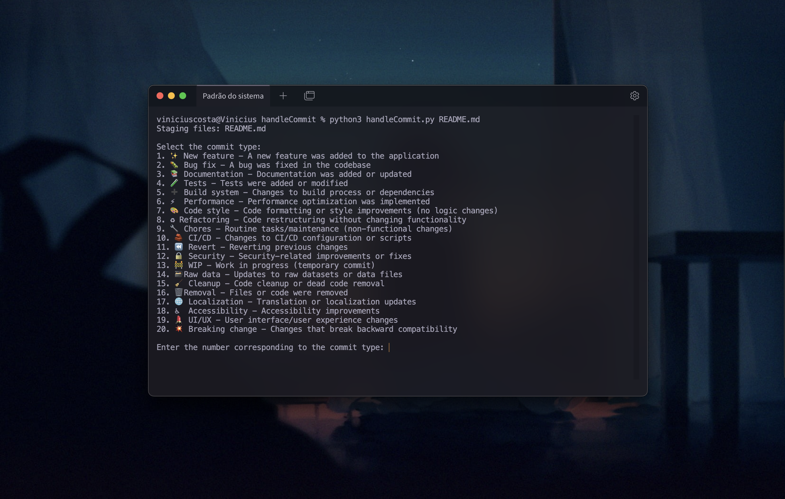

# CommitFlow
A Python script to simplify creating [**semantic commits**](https://www.conventionalcommits.org/en/v1.0.0/) with emojis, type validation, and interactive prompts. Automates `git add` and `git commit` in one step.



---

## Features  
- Interactive commit type selection with emojis and descriptions  
- Title/description validation (length, required fields)  
- Previews commit messages before confirmation  
- Handles `git add` automatically for specified files  
- Add break rows to the description by using `/br`

---

## Installation & Setup

### For Linux/macOS:
```bash
# Add to your ~/.bashrc or ~/.zshrc
alias cf='function _cf() { \
    if [ ! -f ~/.commitflow/handlecommit.py ]; then \
        mkdir -p ~/.commitflow && \
        curl -sSL -o ~/.commitflow/handlecommit.py https://raw.githubusercontent.com/viniciusnevescosta/CommitFlow/main/handleCommit.py; \
    fi; \
    python3 ~/.commitflow/handlecommit.py "$@"; \
}; _cf'
```

### For Windows (PowerShell):

```bash
# Add to your $PROFILE
function cf {
    $scriptPath = "$env:USERPROFILE\.commitflow\handlecommit.py"
    if (-not (Test-Path $scriptPath)) {
        New-Item -ItemType Directory -Path "$env:USERPROFILE\.commitflow" -Force | Out-Null
        Invoke-WebRequest -Uri "https://raw.githubusercontent.com/viniciusnevescosta/CommitFlow/main/handleCommit.py" -OutFile $scriptPath
    }
    python $scriptPath $args
}
```

## Quick Start

### 1. First run (auto-downloads script):

```bash
cf README.md src/app.js  # Linux, macOS or Windows (in PowerShell)
```

### 2. Follow interactive prompts:

```text
Staging files: README.md, src/app.js

Select the commit type:
1. ✨ New feature - A new feature was added to the application
...
```

## How It Works

1. Single Command: cf <files> handles both staging and committing
2. Auto-Update: Script is stored in ~/.commitflow/ (Linux/macOS) or %USERPROFILE%\.commitflow\ (Windows)
4. Portable: Works across all major OSes with Python 3.6+

## Prerequisites

- Python 3.6+
- Git installed locally

## Inspired by

- [iuricode/padroes-de-commits](https://github.com/iuricode/padroes-de-commits)
- [conventional-commits](https://github.com/conventional-commits)

## Notes

- Security: Script is downloaded once and stored locally - verify before first use
- Updates: Delete the script file to force re-download
- Customization: Modify COMMIT_TYPES in the local script file to match your workflow